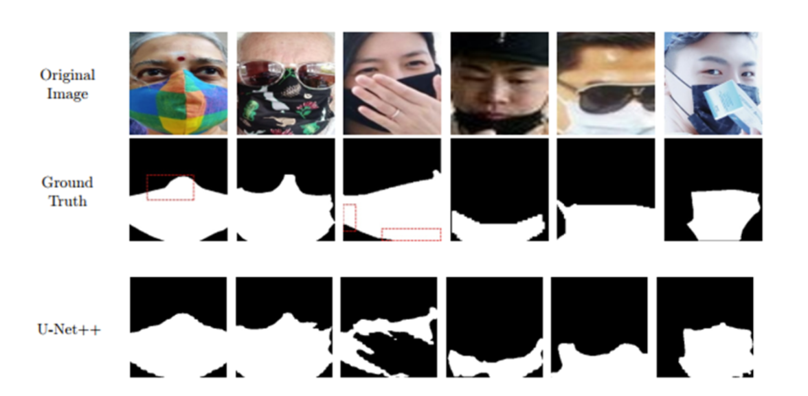

# Face Mask Detection and Segmentation using ML / DL

 - Niranjan Gopal (IMT2022543)
 - Yash Sengupta  (IMT2022532)
 - Teerth Bhalgat (IMT2022586)

## Introduction
This project aims to develop robust methods for detecting face masks in images and segmenting the mask regions. We research the most state of the art DL methodes and cost effective traditional methodes for this task.
The work is divided into four parts:
1. Binary classification using handcrafted features and machine learning
2. Binary classification using CNN
3. Mask segmentation using traditional techniques
4. Mask segmentation using U-Net architectures

## Dataset

For face-mask detection the dataset consists of facial images labeled as "with mask" or "without mask". Key details:
- Source: 
- Contains RGB images of varying resolutions
- Split into training (80%) and testing (20%) sets

For segmentation tasks
- source:
- 

## Methodology

### Part A: Binary Classification Using Handcrafted Features
1. **Feature Extraction**:
   - Used Histogram of Oriented Gradients (HOG) with:
     - 8 orientations
     - 8x8 pixels per cell
     - 2x2 cells per block
2. **Model Training**:
   - Evaluated 9 classifiers (SVM, Decision Tree, Random Forest, etc.)
   - Performed hyperparameter tuning using GridSearchCV/RandomizedSearchCV
   - Implemented Stacking and Voting ensemble which utilizes top 4 best tuned models from HPO 

### Part B: CNN Classification
1. **Architecture**:
   - 3 convolutional layers (32, 64, 128 filters)
   - Max pooling after each conv layer
   - Dense layer (128 units) with dropout (0.5)
   - Sigmoid output
2. **Training**:
   - Adam optimizer
   - Binary cross-entropy loss
   - 10 epochs, batch size 32

### Part C: Traditional Segmentation
1. **Techniques**:
   - Thresholding (global threshold = 127)
   - Canny edge detection (thresholds = 50, 150)
2. **Evaluation**:
   - Dice Coefficient and IoU metrics
   - Contour extraction for refinement

### Part D: U-Net Segmentation
1. **Architectures**:
   - U-Net and U-Net++ variants
   - Backbones: EfficientNet-b7, ResNet50, VGG19
2. **Training**:
   - Standard U-Net training protocol
   - Evaluated multiple backbones

## Hyperparameters and Experiments

### CNN Classification
- Learning rate: Default Adam (≈0.001)
- Batch size: 32
- Activation: ReLU (hidden), Sigmoid (output)
- Dropout: 0.5

### U-Net Models
| Model    | Backbone     | Key Hyperparameters           |
|----------|--------------|-------------------------------|
| U-Net    | Efficient-b7 | Pretrained weights, Adam opt  |
| U-Net++  | ResNet50     | Pretrained weights, Adam opt  |
| U-Net    | VGG19        | Pretrained weights, Adam opt  |

## Results

### Classification Performance
| Model               | Accuracy |
|---------------------|----------|
| CNN                 | 97.0%    |
| Stacking Classifier | 95.0%    |
| Voting Classifier   | 94.8%    |
| CatBoost            | 94.5%    |

### Segmentation Performance
| Method          | Dice   | IoU    |
|-----------------|--------|--------|
| Thresholding    | 0.2562 | 0.3080 |
| U-Net (Eff-b7)  | 0.9447 | 0.8952 |



## Observations and Analysis
1. **Classification**:
   - CNN outperformed traditional ML methods by ~2-9%
   - Ensemble methods provided good alternatives to CNN
2. **Segmentation**:
   - Traditional methods were limited by:
     - Fixed threshold values
     - Sensitivity to lighting/colors
   - U-Net achieved superior results (Dice > 0.94)
3. **Challenges**:
   - Limited dataset for some mask types
   - Variability in mask colors/textures
   - Occlusions and unusual angles

## How to Run the Code
1. **Requirements**:
```bash
    pip install -r requirements.txt
    python classification.py --model [svm|cnn|unet]
    python segmentation.py --method [threshold|canny|unet]
```

## Challenges we faced
When working on optimizing machine learning workflows, we encountered several challenges that required methodical troubleshooting to resolve effectively. Below, we share the issues we faced and the steps we took to overcome them.

CUDA Out of Memory Errors
- One of the initial challenges was managing CUDA memory limitations, which often occurred during model training on large datasets. This issue disrupted the training process and required immediate attention. To address it:
- Reduced Batch Size: we decreased the batch size to --batch_size 16, which significantly lowered memory consumption without compromising training efficiency.
- Utilized a Smaller Model Backbone: Adopting a lightweight backbone reduced the computational demand on the GPU, ensuring smoother execution.

Poor Segmentation Results
- While implementing segmentation models, particularly U-Net, we observed suboptimal performance in the form of inaccurate outputs and poor prediction quality. To improve results:
- Adjusted Threshold Values: Fine-tuning the threshold parameters allowed better discrimination between segmented regions.
- Experimented with Different Backbones for U-Net: Switching to alternative architectures enhanced feature extraction and improved overall accuracy.
- Ensured Proper Image Normalization: Correct normalization processes were crucial to maintaining consistent input quality, ultimately boosting model performance.

Problems while Model Saving and Inferring from Trained Models
- Another significant challenge arose when saving trained models and using them for inference, especially in cases involving custom architectures. These issues impacted the reproducibility and usability of the trained models. Here's how I resolved them:
- Model Saving: Ensured consistent serialization and deserialization by using reliable libraries such as torch.save() and torch.load() for PyTorch models. I also checked for version compatibility between the training and deployment environments.
- Inference Issues: Carefully exported the model to the appropriate format (e.g., ONNX or TensorFlow SavedModel) for compatibility with deployment platforms. This helped mitigate discrepancies during the inference phase.
- Dependency Conflicts: Verified that all required dependencies were correctly installed and aligned with the framework versions used during training. This step minimized errors due to mismatches in libraries.
- Input Shape Validation: To prevent runtime errors, I ensured that the input data during inference matched the expected shapes and preprocessing steps used during training.


Installation Issues
- Setting up the environment presented difficulties due to conflicting dependencies or outdated versions.
- Pip Vs Conda: Tensorflow officially only releases on PyPi channels and does not support conda; meanwhile Ubuntu 24.04 had strange policies regarding system-wide python installation and suggested usage of conda.

## Important Advanced things that we are trying 

- GPU enabled training of scikit learn models ( according to 2025 Google's latest Colab ; Cuda introduced new )
- ABBANet ( the author of MSFD dataset provided a model that out-performs every other model )
- Google drive link of all the train model to run inference on.